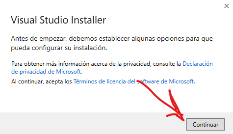
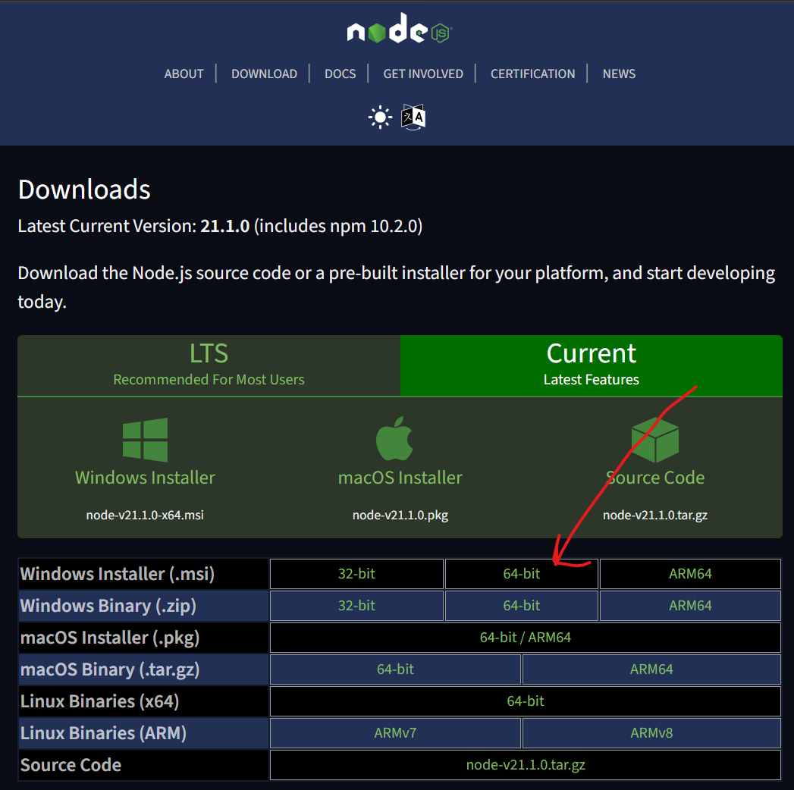
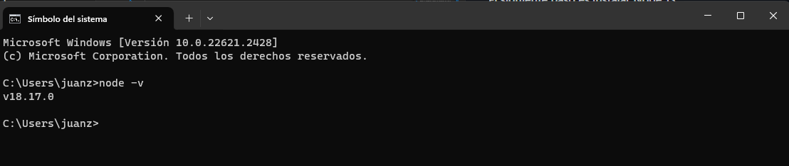

<h1 align="center">
  THE PROJECT
</h1>

## ❓ ¿Qué es?

Vamos a trabajar sobre un proyecto en común, este proyecto es Open Source y es para efectos educativos / emprendimientos.
Para comenzar a programar no se requieren conocimientos previos, es muy importante la practica, vamos a aprender a programar software en la marcha.
El mundo Tech es muy amplio y existen muchos campos a los cuales dedicarse, la programación es solo una fracción de todo lo que comprende un proyecto de software.

Vamos a empezar, es muy sencillo, al inicio hay que seguir los siguientes pasos, luego vamos profundizando en cada uno:

## ⚡ Quick start
### 1. Install GIT

GIT es un sistema de control de versiones de código abierto y gratuito que se utiliza para rastrear los cambios en los archivos y directorios de un proyecto.

- Para instalar GIT en nuestro sistema ingresamos a: <https://git-scm.com/downloads>
- En la página web que acabamos de ingresar vamos a descargar el ejecutable (para Windows):
(paso 1)

(paso 2)

(paso 3) recomiendo ejecutar como administrador*

(paso 4) siguiente, siguiente..., instalar


#### ¡Listo! Nuestro sistema tiene GIT

- Podemos comprobar la instalación, con los siguientes pasos:
  - Abrir CMD (Consola de comandos):  presionamos la tecla WINDOWS y buscamos "CMD", click para abrir la consola.
  
  - Se va a abrir una ventana, esa ventana contiene una consola de comandos, dentro de la consola podemos escribir, para asegurarnos de que GIT quedo instalado, escribimos "git -v" y presionamos enter.
  
  - Van a observar que la consola imprime "git version 2.41.0.windows.3", eso significa que tenemos instalado GIT en su versión 2

### 2. CLONAR CÓDIGO FUENTE CON GIT:
Vamos a comenzar a trabajar con GIT, primero que todo registrarnos en GITHUB https://github.com/signup

Una vez registrados en GITHUB, por fa síganme en mi de GITHUB https://github.com/CodeAIJourney

Thanks... <3

#### GITHUB se va a convertir en su portafolio digital, como desarrolladores o cualquier otra profesión del mundo tech...

Vamos a `CLONAR REPOSITORIO`:
- Abrir CMD (Consola de comandos) y ejecutar los siguientes comandos:
  ```bash
  git clone https://github.com/CodeAIJourney/code-ai-journey.git
  ```
  
- Listo, ya tenemos nuestro primer proyecto de software descargado en nuestra computadora, puedes buscar la carpeta donde quedo descargado:
  
  Podemos copiar la carpeta del proyecto donde lo necesitemos*

### [3. AMBIENTE DE DESARROLLO](public/readme/developer_enviroment.md)

#### Vamos a comenzar instalando Visual Studio Code
  - Para instalar VSC en nuestro sistema ingresamos a: <https://visualstudio.microsoft.com/es/vs/community/>
  - En la página web que acabamos de ingresar vamos a descargar el ejecutable (para Windows):
    (paso 1)
    
    (paso 2) recomiendo ejecutar como administrador*
    
    (paso 3) siguiente, siguiente..., instalar
    
    (paso 4) Una vez instalado, podemos iniciar el programa.
    
  ¡Listo! Nuestro sistema tiene VSC instalado.


#### Vamos a comenzar instalando Visual Studio Code

- Para instalar VSC en nuestro sistema ingresamos a: <https://visualstudio.microsoft.com/es/vs/community/>
- En la página web que acabamos de ingresar vamos a descargar el ejecutable (para Windows):
  (paso 1)
  
  (paso 2) recomiendo ejecutar como administrador*
  
  (paso 3) siguiente, siguiente..., instalar
  
  (paso 4) Una vez instalado, podemos iniciar el programa.
  
  ¡Listo! Nuestro sistema tiene VSC instalado.

#### El siguiente paso es instalar Node JS

- Para instalar Node JS en nuestro sistema ingresamos a: <https://nodejs.org/en/download/current>
- En la página web que acabamos de ingresar vamos a descargar el ejecutable (para Windows):
  (paso 1)
  
  (paso 2)
  
  (paso 3) siguiente, siguiente..., instalar
  
  (paso 4) Una vez instalado, podemos probar nuestra instalación ejecutando el siguiente comando en nuestro CMD
  ```bash
  node -v
  ```
  
  ¡Listo! nuestro sistema tiene Node JS en su versión 18 instalado.

## 4. CORRER EL PROYECTO LOCALMENTE

Abrir la carpeta del proyecto en VSC:


En VSC click derecho en el menu lateral y click en `Abrir en terminal` (CMD):


Se va a abrir un terminal en la ruta del proyecto, vamos a ejecutar dentro del terminal el primer comando:
```bash
npm install
```


Una vez terminado, nuestro proyecto ya cuenta con las `dependencias` necesarias para correr el proyecto localmente, para correr el proyecto ejecutamos:
```bash
npm run start
```


Se va a abrir una nueva pestaña en tú navegados con el proyecto ejecutando en local:


# SI LLEGASTE HASTA ESTE PUNTO, ¡Felicidades!
Ahora podemos comenzar a programar.

## Continuará...
