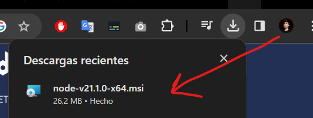
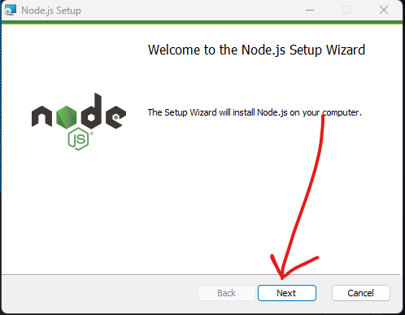

# AMBIENTE DE DESARROLLO - Tabla de índices

## [Link to introduction](#introduction)

* [¿Qué es un ambiente de desarrollo?](#que-es-un-ambiente-de-desarrollo)
* [Como afecta mi sistema operativo](#como-afecta-mi-sistema-operativo)

## [Link to tools install](#tools-install)

* [Install Visual Studio Code](#install-visual-studio-code)
* [Install Node JS](#install-node-js)

## [Link to config tools](#config-tools)

* [Config Visual Studio Code](#config-visual-studio-code)

## Introduction

### Que es un ambiente de desarrollo

Un ambiente de desarrollo es un conjunto de herramientas, configuraciones y software que se utilizan para crear y probar software. Un buen ambiente de desarrollo configurado puede ayudar a los desarrolladores a ser más productivos y eficientes, y a crear software de mayor calidad.

### Como afecta mi sistema operativo

El sistema operativo afecta la configuración de tu ambiente de desarrollo de varias maneras, incluyendo:

* La disponibilidad de herramientas y software: Algunos sistemas operativos tienen más herramientas y software de desarrollo disponibles que otros. Por ejemplo, macOS y Linux tienen una amplia gama de herramientas de desarrollo disponibles de forma gratuita, mientras que Windows tiene menos herramientas disponibles de forma gratuita.
* La compatibilidad de las herramientas y el software: Algunas herramientas y software de desarrollo solo son compatibles con ciertos sistemas operativos. Por ejemplo, Visual Studio solo es compatible con Windows, mientras que Xcode solo es compatible con macOS.
* La configuración del entorno: La configuración del entorno puede variar según el sistema operativo. Por ejemplo, en macOS, el editor de código predeterminado es TextEdit, mientras que en Windows, el editor de código predeterminado es Notepad.

## [Tools install](#tools-install)

### Install Visual Studio Code

* Para instalar VSC en nuestro sistema ingresamos a: <https://visualstudio.microsoft.com/es/vs/community/>
* En la página web que acabamos de ingresar vamos a descargar el ejecutable (para Windows):
    (paso 1)
    
    (paso 2) recomiendo ejecutar como administrador*
    
    (paso 3) siguiente, siguiente..., instalar
    
    (paso 4) Una vez instalado, podemos iniciar el programa.
    
  ¡Listo! Nuestro sistema tiene VSC instalado.

#### Vamos a comenzar instalando Visual Studio Code

* Para instalar VSC en nuestro sistema ingresamos a: <https://visualstudio.microsoft.com/es/vs/community/>
* En la página web que acabamos de ingresar vamos a descargar el ejecutable (para Windows):
  (paso 1)
  
  (paso 2) recomiendo ejecutar como administrador*
  
  (paso 3) siguiente, siguiente..., instalar
  
  (paso 4) Una vez instalado, podemos iniciar el programa.
  
  ¡Listo! Nuestro sistema tiene VSC instalado.

### Install Node JS

* Para instalar Node JS en nuestro sistema ingresamos a: <https://nodejs.org/en/download/current>
* En la página web que acabamos de ingresar vamos a descargar el ejecutable (para Windows):
  (paso 1)
  
  (paso 2)
  
  (paso 3) siguiente, siguiente..., instalar
  
  (paso 4) Una vez instalado, podemos probar nuestra instalación ejecutando el siguiente comando en nuestro CMD

  ```bash
  node -v
  ```

  
  ¡Listo! nuestro sistema tiene Node JS en su versión 18 instalado.

## [Config Tools](#config-tools)

### Config Visual Studio Code

Configurar...
